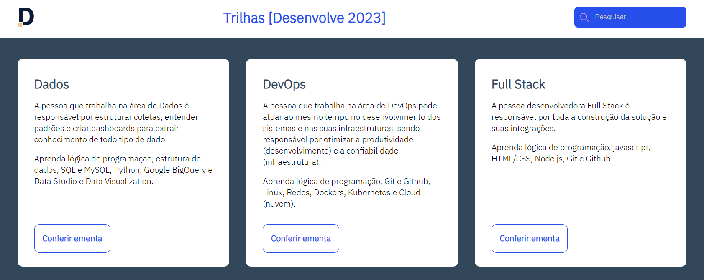

<h1 align="center">Desafio trilha FullStack - Programa Desenvolve</h1>

O desafio é criar o main e o footer da página do Programa Desenvolve do Grupo Boticário

    

## 🧑‍💻Tecnologias Utilizadas
- HTML
- CSS
- Figma
- Git / Github

## 🔍Layout
Você pode visualizar o layout do projeto através [DESSE LINK](https://milenaemmert.notion.site/Desafio-Criando-a-Main-e-o-Footer-da-p-gina-a87c70459fb942aba9b62cc952a17128). É necessário ter conta no [FIGMA](https://www.figma.com/) para acessá-lo.